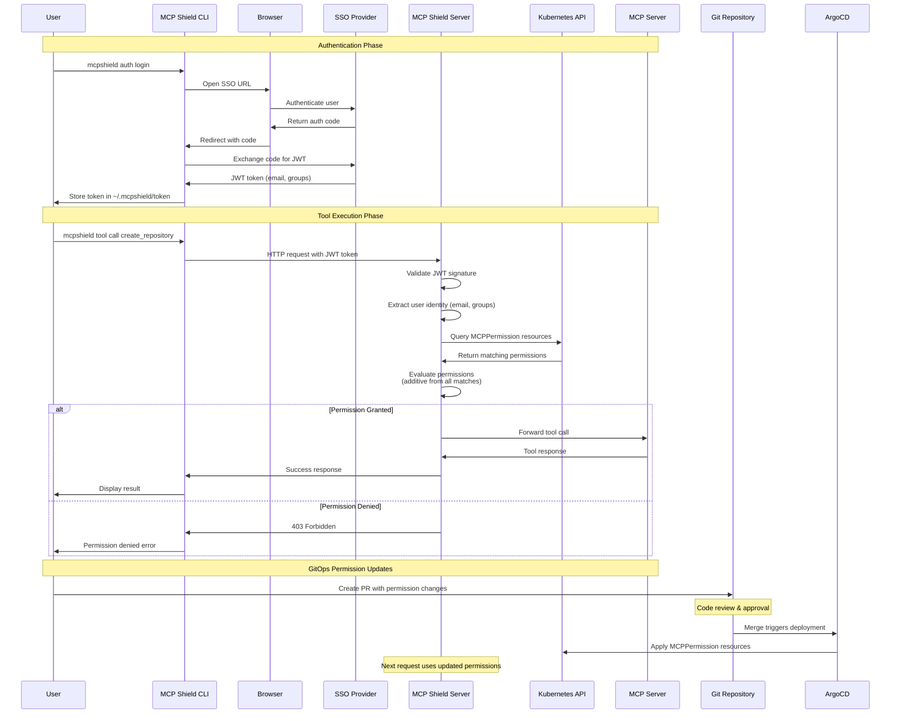

# MCP Shield Authentication & Authorization

## Overview

MCP Shield uses a two-phase approach:
- **Authentication**: JWT tokens via CLI/SSO flow
- **Authorization**: Kubernetes-native MCPPermission resources

## Authentication Flow

### 1. User Login
```bash
mcpshield auth login
```

This command:
- Opens browser to SSO provider (Google, Okta, etc.)
- User authenticates with corporate SSO
- MCP Shield server creates JWT token with user claims (email, groups)
- Server stores token (in-memory cache or database) for tracking/revocation
- CLI receives and stores token locally (`~/.mcpshield/token`)

### 2. Token Usage
```bash
# Get current token
mcpshield auth token
```

Add to wichever tool you want to use:

```json
{
  "mcpServers": {
    "mcp-shield": {
      "type": "streamable-http",
      "url": "http://<mcp-shield-url>:8080/mcp",
      "headers": {
         "Authorization": "Bearer <token>"
      }
    }
  }
}
```

### 3. Token Validation
When MCP Shield receives requests:
- Extracts JWT token from Authorization header
- Validates JWT signature and expiration
- Unwraps user identity (email, groups) from token claims
- Uses identity to query MCPPermission resources for authorization

## Authorization Flow

### 1. Permission Definition
Permissions are defined as Kubernetes resources in your monorepo:

```yaml
# permissions/nsx-defaults.yaml
apiVersion: mcpshield.io/v1alpha1
kind: MCPPermission
metadata:
  name: nsx-defaults
spec:
  subjects:
    - emailDomain: "nsx.bet"
  servers:
    github-npx: ["search_*", "get_*", "list_*"]
    slack-mcp: ["send_message", "get_channels"]
---
# permissions/sre-team.yaml
apiVersion: mcpshield.io/v1alpha1
kind: MCPPermission
metadata:
  name: sre-permissions
spec:
  subjects:
    - emailGroup: "sre@nsx.bet"
  servers:
    github-npx: ["create_*", "delete_*"]
    k8s-mcp: ["*"]
```

### 2. Permission Evaluation
For each request, MCP Shield:
1. Gets user identity from JWT token (cached in-memory for performance)
2. Looks up permissions from in-memory cache (not K8s API for every request)
3. Finds matching permissions (email domain, groups, individual email)
4. Combines all matching permissions (additive)
5. Checks if requested tool is allowed
6. Allows/denies request

**Performance Note**: MCPPermission resources are watched and cached in-memory. Tokens are also cached to avoid repeated validation. Only permission changes trigger K8s API calls.

### 3. GitOps Workflow
- Permissions stored in Git monorepo
- Changes via Pull Request
- Approval process for permission changes
- ArgoCD/Flux applies changes to Kubernetes
- Instant permission updates (no restart needed)

## Token Storage

JWT tokens are stored:
- **Client side**: `~/.mcpshield/token` file
- **Server side**: No persistent storage needed
- **Validation**: Stateless JWT validation
- **Caching**: Optional in-memory cache for performance

## Security Considerations

- JWT tokens have expiration (configurable, default 24h)
- Tokens are validated on every request
- No long-lived credentials in Kubernetes
- Permissions are version-controlled and auditable
- SSO integration provides centralized auth management


# MCP Shield Authentication & Authorization

## Overview

MCP Shield uses a two-phase approach:
- **Authentication**: JWT tokens via CLI/SSO flow
- **Authorization**: Kubernetes-native MCPPermission resources

## Flow Diagram

