# MCP Flow Comparison

This document illustrates the difference between a standard Model Context Protocol (MCP) client-server interaction and the flow when using MCP Shield as a proxy.

## Flow Diagram

```mermaid
graph TD
    subgraph "MCP Shield Flow"
        Client2[Client e.g., Cursor]
        MCPShield[MCP Shield]
        ManagedMCPServer[Managed MCP Server 1..n]
        Service2[External Service 1..n]

        Client2 -- "Invoke Tool via Single Endpoint" --> MCPShield
        MCPShield -- "Proxy to Correct MCP Server" --> ManagedMCPServer
        ManagedMCPServer -- "Authenticate & Call Service" --> Service2
        Service2 -- "Return Data" --> ManagedMCPServer
        ManagedMCPServer -- "Return Result" --> MCPShield
        MCPShield -- "Return Aggregated Result" --> Client2
    end

    subgraph "Standard MCP Flow"
        Client1[Client e.g., Cursor]
        MCPServer1[Directly Configured MCP Server]
        Service1[External Service e.g., GitHub API]

        Client1 -- "Invoke Tool" --> MCPServer1
        MCPServer1 -- "Authenticate & Call Service" --> Service1
        Service1 -- "Return Data" --> MCPServer1
        MCPServer1 -- "Return Result" --> Client1
    end


```

## Key Differences

| Feature            | Standard Flow                                                     | MCP Shield Flow                                              |
|--------------------|-------------------------------------------------------------------|--------------------------------------------------------------|
| **Configuration**  | Client configures each MCP server individually.                   | Client configures a single MCP Shield endpoint.              |
| **Tool Discovery** | Tools are available from one configured server at a time.         | Tools from all managed servers are aggregated and available. |
| **Authentication** | Handled per-server, often requiring credentials in client config. | Centralized via short-lived JWT tokens (SSO flow).           |
| **Authorization**  | Managed by the MCP server itself, if at all.                      | Centralized, fine-grained RBAC via Kubernetes resources.     |
| **Security**       | Credentials may be exposed on the client-side.                    | Credentials and server logic are isolated from the client.   |